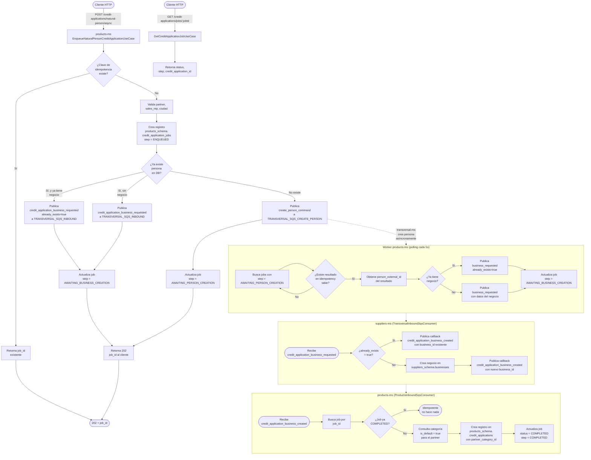

# Diagrama de Flujo — Solicitud de Crédito Asíncrona

```mermaid
flowchart TD
    A([Cliente HTTP]) -->|POST /credit-applications/natural-person/async| B[products-ms\nEnqueueNaturalPersonCreditApplicationUseCase]

    B --> C{¿Clave de\nidempotencia\nexiste?}
    C -->|Sí| D[Retorna job_id\nexistente]
    C -->|No| E[Valida partner,\nsales_rep, ciudad]

    E --> F[Crea registro\nproducts_schema.\ncredit_application_jobs\nstep = ENQUEUED]

    F --> G{¿Ya existe\npersona\nen DB?}

    G -->|Sí, y ya tiene\nnegocio| H[Publica\ncredit_application_business_requested\nalready_exists=true\na TRANSVERSAL_SQS_INBOUND]
    G -->|Sí, sin\nnegocio| I[Publica\ncredit_application_business_requested\na TRANSVERSAL_SQS_INBOUND]
    G -->|No existe| J[Publica\ncreate_person_command\na TRANSVERSAL_SQS_CREATE_PERSON]

    H --> K[Actualiza job\nstep = AWAITING_BUSINESS_CREATION]
    I --> K
    J --> L[Actualiza job\nstep = AWAITING_PERSON_CREATION]

    K --> M[Retorna 202\njob_id al cliente]
    L --> M
    D --> M2([202 + job_id])
    M --> M2

    subgraph WORKER["Worker products-ms (polling cada 5s)"]
        W1[Busca jobs con\nstep = AWAITING_PERSON_CREATION] --> W2{¿Existe resultado\nen idempotency\ntable?}
        W2 -->|No| W1
        W2 -->|Sí| W3[Obtiene person_external_id\ndel resultado]
        W3 --> W4{¿Ya tiene\nnegocio?}
        W4 -->|Sí| W5[Publica business_requested\nalready_exists=true]
        W4 -->|No| W6[Publica business_requested\ncon datos del negocio]
        W5 --> W7[Actualiza job\nstep = AWAITING_BUSINESS_CREATION]
        W6 --> W7
    end

    subgraph SUPPLIERS["suppliers-ms (TransversalInboundSqsConsumer)"]
        S1([Recibe\ncredit_application_business_requested]) --> S2{¿already_exists\n= true?}
        S2 -->|Sí| S3[Publica callback\ncredit_application_business_created\n con business_id existente]
        S2 -->|No| S4[Crea negocio en\nsuppliers_schema.businesses]
        S4 --> S5[Publica callback\ncredit_application_business_created\ncon nuevo business_id]
    end

    subgraph PRODUCTS_INBOUND["products-ms (ProductsInboundSqsConsumer)"]
        P1([Recibe\ncredit_application_business_created]) --> P2[Busca job por\njob_id]
        P2 --> P3{¿Job ya\nCOMPLETED?}
        P3 -->|Sí| P4([Idempotente\nno hace nada])
        P3 -->|No| P5[Consulta categoría\nis_default = true\npara el partner]
        P5 --> P6[Crea registro en\nproducts_schema.\ncredit_applications\ncon partner_category_id]
        P6 --> P7[Actualiza job\nstatus = COMPLETED\nstep = COMPLETED]
    end

    J -.->|transversal-ms\ncrea persona\nasíncronamente| WORKER
    WORKER -.-> SUPPLIERS
    SUPPLIERS -.-> PRODUCTS_INBOUND

    N([Cliente HTTP]) -->|GET /credit-applications/jobs/:jobId| O[GetCreditApplicationJobUseCase]
    O --> P[Retorna status,\nstep, credit_application_id]
```
