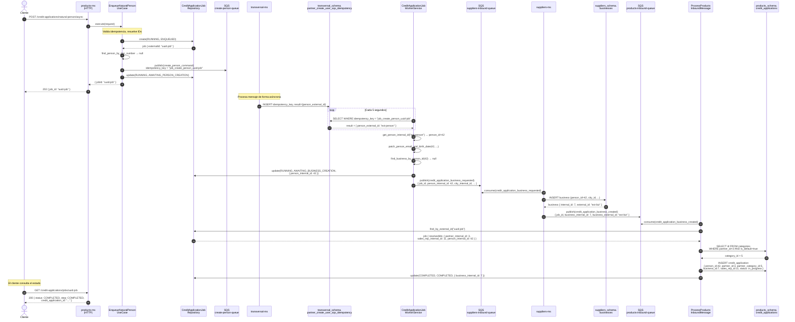
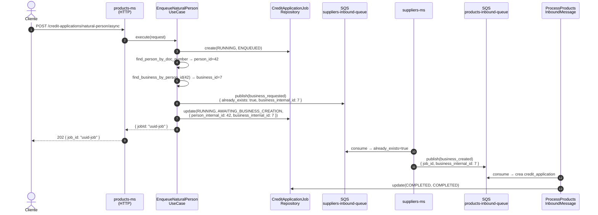

# Diagrama de Secuencia — Solicitud de Crédito Asíncrona

## Camino feliz: persona nueva, negocio nuevo

```mermaid
sequenceDiagram
    autonumber
    actor Cliente
    participant API as products-ms<br/>(HTTP)
    participant EnqUC as EnqueueNaturalPerson<br/>UseCase
    participant JobRepo as CreditApplicationJob<br/>Repository
    participant SQS_Person as SQS<br/>create-person-queue
    participant Transversal as transversal-ms
    participant IdempTable as transversal_schema.<br/>partner_create_user_sqs_idempotency
    participant Worker as CreditApplicationJob<br/>WorkerService
    participant SQS_Biz as SQS<br/>suppliers-inbound-queue
    participant Suppliers as suppliers-ms
    participant BizRepo as suppliers_schema.<br/>businesses
    participant SQS_Prod as SQS<br/>products-inbound-queue
    participant InboundUC as ProcessProducts<br/>InboundMessage
    participant AppRepo as products_schema.<br/>credit_applications

    Cliente->>API: POST /credit-applications/natural-person/async
    API->>EnqUC: execute(request)

    Note over EnqUC: Valida idempotencia, resuelve IDs

    EnqUC->>JobRepo: create(RUNNING, ENQUEUED)
    JobRepo-->>EnqUC: job { externalId: "uuid-job" }

    EnqUC->>EnqUC: find_person_by_doc_number → null
    EnqUC->>SQS_Person: publish(create_person_command)<br/>idempotency_key = "job_create_person_uuid-job"
    EnqUC->>JobRepo: update(RUNNING, AWAITING_PERSON_CREATION)
    EnqUC-->>API: { jobId: "uuid-job" }
    API-->>Cliente: 202 { job_id: "uuid-job" }

    Note over Transversal: Procesa mensaje de forma asíncrona
    Transversal->>IdempTable: INSERT idempotency_key, result={person_external_id}

    loop Cada 5 segundos
        Worker->>IdempTable: SELECT WHERE idempotency_key = "job_create_person_uuid-job"
        IdempTable-->>Worker: result = { person_external_id: "ext-person" }
    end

    Worker->>Worker: get_person_internal_id("ext-person") → person_id=42
    Worker->>Worker: patch_person_email_and_birth_date(42, ...)
    Worker->>Worker: find_business_by_person_id(42) → null

    Worker->>JobRepo: update(RUNNING, AWAITING_BUSINESS_CREATION,<br/>{ person_internal_id: 42 })
    Worker->>SQS_Biz: publish(credit_application_business_requested)<br/>{ job_id, person_internal_id: 42, city_internal_id, ... }

    Suppliers->>SQS_Biz: consume(credit_application_business_requested)
    Suppliers->>BizRepo: INSERT business (person_id=42, city_id, ...)
    BizRepo-->>Suppliers: business { internal_id: 7, external_id: "ext-biz" }
    Suppliers->>SQS_Prod: publish(credit_application_business_created)<br/>{ job_id, business_internal_id: 7, business_external_id: "ext-biz" }

    InboundUC->>SQS_Prod: consume(credit_application_business_created)
    InboundUC->>JobRepo: find_by_external_id("uuid-job")
    JobRepo-->>InboundUC: job { resolvedIds: { partner_internal_id: 3,<br/>sales_rep_internal_id: 11, person_internal_id: 42 } }

    InboundUC->>AppRepo: SELECT id FROM categories<br/>WHERE partner_id=3 AND is_default=true
    AppRepo-->>InboundUC: category_id = 5

    InboundUC->>AppRepo: INSERT credit_application<br/>{ person_id:42, partner_id:3, partner_category_id:5,<br/>business_id:7, sales_rep_id:11, status: in_progress }
    InboundUC->>JobRepo: update(COMPLETED, COMPLETED, { business_internal_id: 7 })

    Note over Cliente: El cliente consulta el estado

    Cliente->>API: GET /credit-applications/jobs/uuid-job
    API-->>Cliente: 200 { status: COMPLETED, step: COMPLETED,<br/>credit_application_id: "..." }
```

## Camino: persona ya existente con negocio ya creado

```mermaid
sequenceDiagram
    autonumber
    actor Cliente
    participant API as products-ms<br/>(HTTP)
    participant EnqUC as EnqueueNaturalPerson<br/>UseCase
    participant JobRepo as CreditApplicationJob<br/>Repository
    participant SQS_Biz as SQS<br/>suppliers-inbound-queue
    participant Suppliers as suppliers-ms
    participant SQS_Prod as SQS<br/>products-inbound-queue
    participant InboundUC as ProcessProducts<br/>InboundMessage

    Cliente->>API: POST /credit-applications/natural-person/async
    API->>EnqUC: execute(request)
    EnqUC->>JobRepo: create(RUNNING, ENQUEUED)
    EnqUC->>EnqUC: find_person_by_doc_number → person_id=42
    EnqUC->>EnqUC: find_business_by_person_id(42) → business_id=7
    EnqUC->>SQS_Biz: publish(business_requested)<br/>{ already_exists: true, business_internal_id: 7 }
    EnqUC->>JobRepo: update(RUNNING, AWAITING_BUSINESS_CREATION,<br/>{ person_internal_id: 42, business_internal_id: 7 })
    EnqUC-->>API: { jobId: "uuid-job" }
    API-->>Cliente: 202 { job_id: "uuid-job" }

    Suppliers->>SQS_Biz: consume → already_exists=true
    Suppliers->>SQS_Prod: publish(business_created)<br/>{ job_id, business_internal_id: 7 }

    InboundUC->>SQS_Prod: consume → crea credit_application
    InboundUC->>JobRepo: update(COMPLETED, COMPLETED)
```
