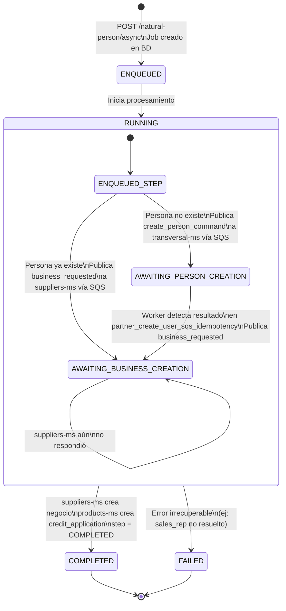
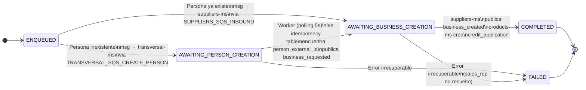
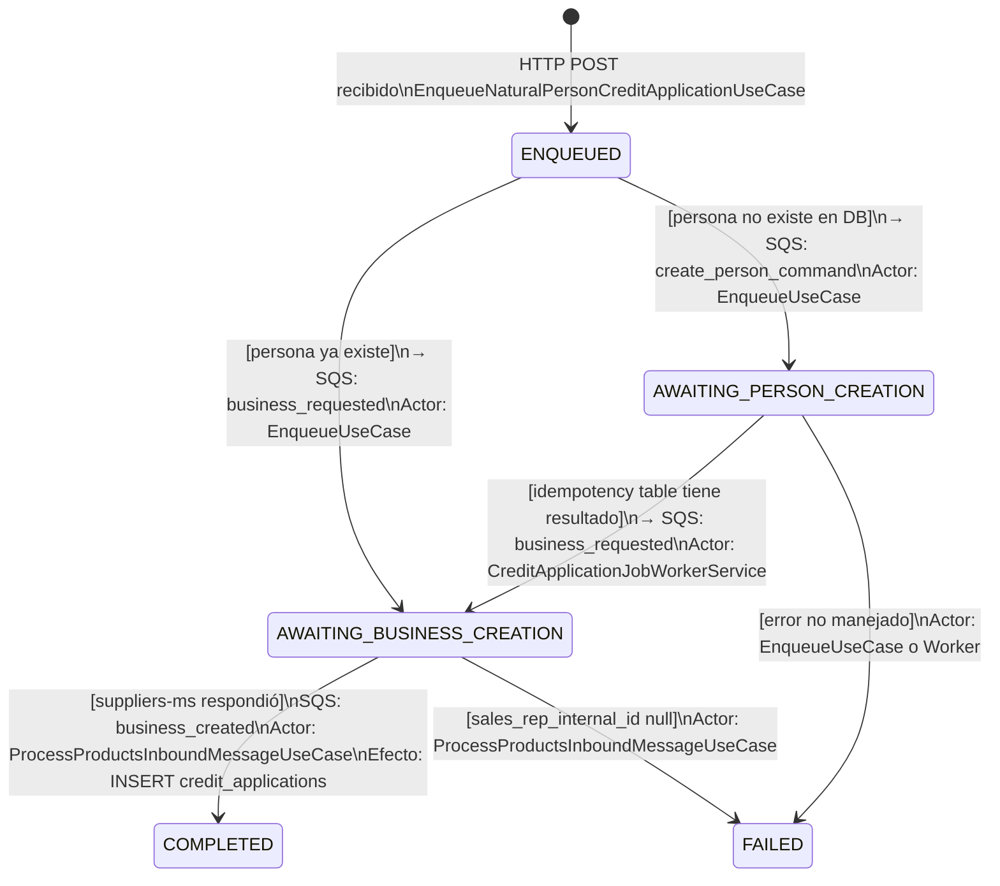

# Diagrama de Estados — Job de Solicitud de Crédito (`credit_application_jobs`)

## Estados del job

## Detalle de transiciones por step

## Eventos que disparan transiciones

## Estados del `status` vs `step` en la tabla

| `status`    | `step`                        | Descripción                                                   |
|-------------|-------------------------------|---------------------------------------------------------------|
| `RUNNING`   | `ENQUEUED`                    | Job creado, aún no procesado (transitorio, milisegundos)     |
| `RUNNING`   | `AWAITING_PERSON_CREATION`    | Esperando que transversal-ms cree la persona vía SQS          |
| `RUNNING`   | `AWAITING_BUSINESS_CREATION`  | Esperando que suppliers-ms cree el negocio vía SQS            |
| `COMPLETED` | `COMPLETED`                   | `credit_application` creada exitosamente                      |
| `FAILED`    | `FAILED`                      | Error irrecuperable; ver campo `error_message`                |
