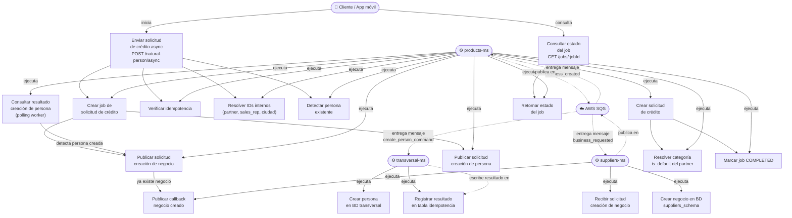

# Diagrama de Casos de Uso — Solicitud de Crédito Asíncrona

```mermaid
graph TD
    %% Actores
    Cliente(["👤 Cliente / App móvil"])
    ProductsMS(["⚙️ products-ms"])
    SuppliersMS(["⚙️ suppliers-ms"])
    TransversalMS(["⚙️ transversal-ms"])
    SQS(["☁️ AWS SQS"])

    %% Casos de uso del cliente
    UC1["Enviar solicitud\nde crédito async\nPOST /natural-person/async"]
    UC2["Consultar estado\ndel job\nGET /jobs/:jobId"]

    %% Casos de uso products-ms
    UC3["Crear job de\nsolicitud de crédito"]
    UC4["Verificar idempotencia"]
    UC5["Resolver IDs internos\n(partner, sales_rep, ciudad)"]
    UC6["Detectar persona\nexistente"]
    UC7["Publicar solicitud\ncreación de persona"]
    UC8["Publicar solicitud\ncreación de negocio"]
    UC9["Consultar resultado\ncreación de persona\n(polling worker)"]
    UC10["Crear solicitud\nde crédito"]
    UC11["Resolver categoría\nis_default del partner"]
    UC12["Marcar job COMPLETED"]
    UC13["Retornar estado\ndel job"]

    %% Casos de uso suppliers-ms
    UC14["Recibir solicitud\ncreación de negocio"]
    UC15["Crear negocio en BD\nsuppliers_schema"]
    UC16["Publicar callback\nnegocio creado"]

    %% Casos de uso transversal-ms
    UC17["Crear persona\nen BD transversal"]
    UC18["Registrar resultado\nen tabla idempotencia"]

    %% Relaciones cliente → productos-ms
    Cliente -->|inicia| UC1
    Cliente -->|consulta| UC2

    UC1 --> UC4
    UC1 --> UC3
    UC1 --> UC5
    UC1 --> UC6
    UC3 --> UC7
    UC3 --> UC8

    UC2 --> UC13

    %% Relaciones products-ms interno
    UC9 -->|detecta persona creada| UC8
    UC8 -->|ya existe negocio| UC16
    UC10 --> UC11
    UC10 --> UC12

    %% Actores → casos de uso
    ProductsMS -->|ejecuta| UC3
    ProductsMS -->|ejecuta| UC4
    ProductsMS -->|ejecuta| UC5
    ProductsMS -->|ejecuta| UC6
    ProductsMS -->|ejecuta| UC7
    ProductsMS -->|ejecuta| UC8
    ProductsMS -->|ejecuta| UC9
    ProductsMS -->|ejecuta| UC10
    ProductsMS -->|ejecuta| UC11
    ProductsMS -->|ejecuta| UC12
    ProductsMS -->|ejecuta| UC13

    SuppliersMS -->|ejecuta| UC14
    SuppliersMS -->|ejecuta| UC15
    SuppliersMS -->|ejecuta| UC16

    TransversalMS -->|ejecuta| UC17
    TransversalMS -->|ejecuta| UC18

    %% SQS como canal
    SQS -.->|entrega mensaje\ncreate_person_command| TransversalMS
    SQS -.->|entrega mensaje\nbusiness_requested| SuppliersMS
    SQS -.->|entrega mensaje\nbusiness_created| ProductsMS

    ProductsMS -.->|publica en| SQS
    SuppliersMS -.->|publica en| SQS
    TransversalMS -.->|escribe resultado en| UC18
```
